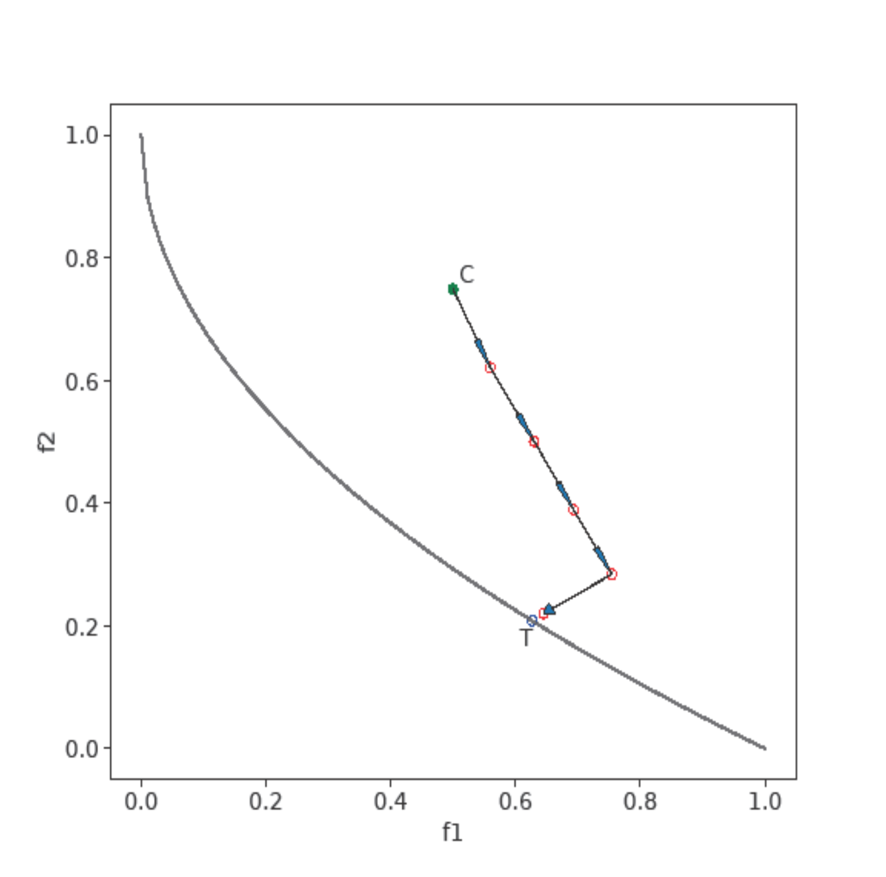

# Innovation Path: Discovering an Ordered Set of Optimized Intermediate Solutions

This repository contains the implementation of the **Innovation Path** method described in the paper:

**Khan, Ahmer, and Kalyanmoy Deb. "Innovation Path: Discovering an Ordered Set of Optimized Intermediate Solutions from an Existing to a Desired Solution." Proceedings of the Genetic and Evolutionary Computation Conference. 2024.**

## Abstract

The **Innovation Path** methodology aims to discover an ordered set of optimized intermediate solutions between an initial and a desired solution. This approach introduces a novel path-planning framework using evolutionary optimization that ensures the discovery of meaningful intermediate solutions while respecting the constraints of each transition. The innovation path methodology is particularly useful for problems where a smooth progression between two design points is required, with each step optimized and validated.

## Prerequisites

- **pymoo**: This implementation requires the `pymoo` library as the optimization backend. Please ensure that you have it installed by running the following:

```
pip install pymoo
```

## Installation

1. Clone the repository:

```
git clone https://github.com/your-repo/innovation-path.git
cd Innovation_Path
```

## Usage

To run the **Innovation Path** algorithm, execute the main script:

```
python main.py
```

Ensure that you provide the necessary variables as per your optimization problem setup. You need to implement and pass a **Step Constraint** class that includes:

### Step Constraint Class

The class must have an attribute `delta`, which defines the step size for the constraint, and must return the following:

1. **Bracketed sum of constraint violations**.
2. **Constraint violations**.
3. **Right-hand side of the constraint**.

For guidance on implementing the constraint function, refer to the example provided in the **utilities** section of the paper.

```python
class StepConstraint:
    def __init__(self, delta):
        self.delta = delta
    
    def evaluate(self, anchor_var_vec,anchor_obj_vec,point_var_vec,point_obj_vec):
        # Compute constraint violations and related values
        bracketed_sum = ... # Sum of constraint violations
        violations = ...    # Actual violations
        rhs = ...           # Right-hand side values
        return bracketed_sum, violations, rhs
```

For an understanding of the constraint structure, review the detailed description of the constraint function in the **utilities** section of the paper.

## Results and Figures

The **Innovation Path** method was successfully tested on several optimization scenarios. The figure below, taken from the paper, illustrates an example of an innovation path with optimized intermediate solutions from the initial to the desired solution:



*Figure 1: Example of an Innovation Path showing the transition from the initial solution to the desired solution.*

## Citing the Paper

If you use this implementation in your work, please cite the following:

```
@inproceedings{khan2024innovationpath,
  title={Innovation Path: Discovering an Ordered Set of Optimized Intermediate Solutions from an Existing to a Desired Solution},
  author={Khan, Ahmer and Deb, Kalyanmoy},
  booktitle={Proceedings of the Genetic and Evolutionary Computation Conference},
  year={2024}
```

## License

This project is licensed under the MIT License - see the [LICENSE](LICENSE) file for details.

